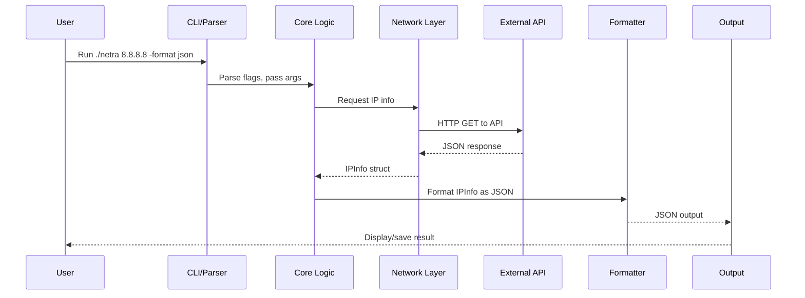
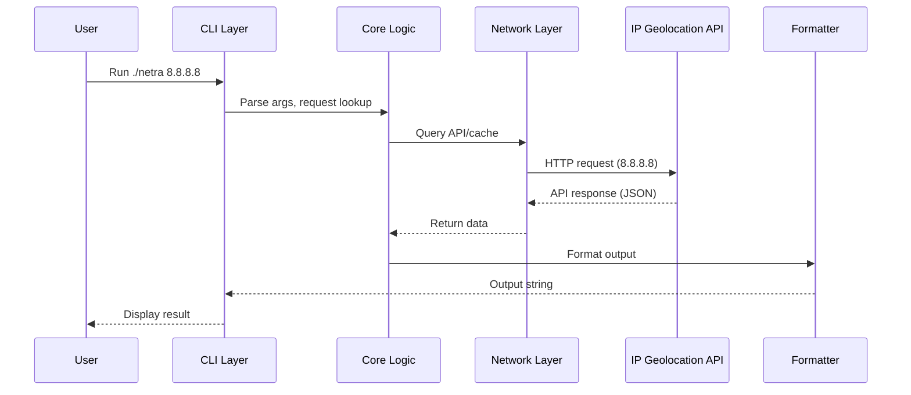
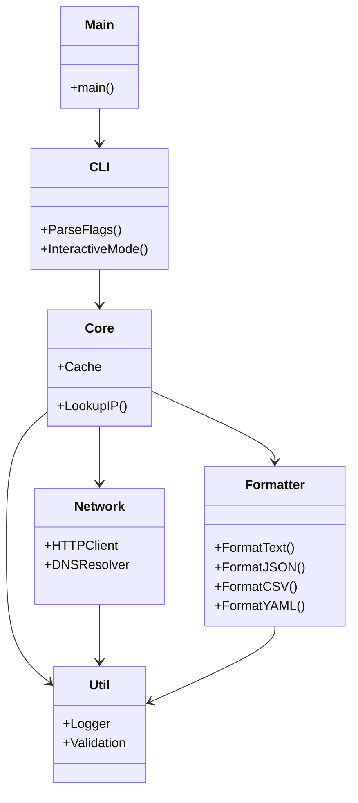

# Netra

Netra is a powerful, extensible, and user-friendly CLI tool for IP geolocation, network intelligence, and OSINT research. It enables security professionals, researchers, and network engineers to query IP addresses, analyze metadata, and automate lookups for a variety of use cases.

---

## Table of Contents

- [Features](#features)
- [Demo](#demo)
- [Why Netra?](#why-netra)
- [Architecture Overview](#architecture-overview)
- [Component Diagram](#component-diagram)
- [Data Flow Diagram](#data-flow-diagram)
- [Technical Deep-Dives](#technical-deep-dives)
- [Usage Scenarios](#usage-scenarios)
- [Installation](#installation)
- [Quick Start](#quick-start)
- [Usage](#usage)
- [Command Reference](#command-reference)
- [Output Formats](#output-formats)
- [Configuration](#configuration)
- [Advanced Usage](#advanced-usage)
- [API Integration](#api-integration)
- [Security & Privacy](#security--privacy)
- [Testing](#testing)
- [Development](#development)
- [Contributing](#contributing)
- [Troubleshooting](#troubleshooting)
- [FAQ](#faq)
- [License](#license)
- [Author](#author)

---

## Features

- Query geolocation and network metadata for any IP address (IPv4 & IPv6)
- Supports output formats: **text**, **JSON**, **CSV**, **YAML**
- Batch lookup from file
- Save results to file
- Interactive REPL mode for quick lookups
- Customizable output fields
- Caching and retry logic for API requests
- Proxy and custom DNS support
- Modular, extensible Go codebase
- Colorful CLI output and banners
- Open source (MIT License)
- Easy integration with scripts and pipelines
- Designed for security, research, and automation

---

## Demo

```sh
$ ./netra 8.8.8.8
Ip: 8.8.8.8
Country: United States
City: Mountain View
Region: California
ASN: AS15169
...etc
```

---

## Why Netra?

- **Fast & Reliable:** Built in Go for speed and concurrency.
- **Extensible:** Add new output formats, fields, or data sources easily.
- **Scriptable:** Designed for automation, CI/CD, and integration.
- **Privacy-Respecting:** No tracking, no analytics, open source.
- **Community-Driven:** Contributions and feature requests welcome!

---

## Architecture Overview

Netra is organized into modular Go packages:

- `cmd/netra/` — CLI entrypoint
- `internal/cli/` — CLI parsing, flags, and interactive mode
- `internal/core/` — Core business logic, caching, and API orchestration
- `internal/network/` — HTTP, DNS, and proxy logic
- `internal/formatter/` — Output formatting (text, JSON, CSV, YAML)
- `internal/util/` — Utility functions, logging, validation
- `config/` — Configuration files
- `test/` — Automated tests

See [docs/README.md](docs/README.md) for a deeper dive into the architecture and codebase.

---

## Component Diagram

```mermaid
graph TD
    CLI[CLI Entry (cmd/netra)] -->|parses flags| CLI_PARSER[CLI Parser (internal/cli)]
    CLI_PARSER -->|calls| CORE[Core Logic (internal/core)]
    CORE -->|fetches| NETWORK[Network Layer (internal/network)]
    CORE -->|formats| FORMATTER[Formatter (internal/formatter)]
    CORE -->|logs/errors| UTIL[Utils/Logger (internal/util)]
    NETWORK -->|HTTP/DNS| API[External API / DNS]
    FORMATTER -->|outputs| CLI
```

---

## Data Flow Diagram



---

## Technical Deep-Dives

### Modular Design & Data Flow

Netra is built with a clean separation of concerns, making it easy to extend and maintain. The main flow for a CLI lookup is:

1. **CLI Entry (cmd/netra/main.go):** Parses flags, arguments, and initializes the app.
2. **CLI Layer (internal/cli):** Handles user input, interactive mode, and command dispatch.
3. **Core Logic (internal/core):** Orchestrates lookups, caching, and API calls.
4. **Network Layer (internal/network):** Manages HTTP, DNS, and proxy logic.
5. **Formatter (internal/formatter):** Formats results for output (text, JSON, CSV, YAML).
6. **Utils (internal/util):** Logging, validation, and helpers.

### Sequence Diagram: CLI Lookup



### Class Diagram: Main Packages



### Error Handling & Caching

- **Error Handling:** All network and API errors are caught and reported with clear messages. The CLI exits with non-zero codes on failure.
- **Caching:** Results are cached in-memory for the session to avoid redundant API calls. (See `internal/core/cache.go`)
- **Extensibility:** Add new output formats by implementing the `Formatter` interface. Add new data sources by extending the network and core layers.

---

## Usage Scenarios

### Security Operations

- **Threat Intelligence:** Quickly enrich IPs from logs or alerts to identify suspicious activity.
- **Incident Response:** Automate lookups for IPs involved in incidents using batch mode or scripts.

### Automation & Scripting

- **CI/CD Integration:** Use Netra in pipelines to validate IPs or enrich deployment logs.
- **Bulk Analysis:** Pipe results to `jq`, `awk`, or import CSV into SIEM tools.

### Research & OSINT

- **Network Mapping:** Map out infrastructure by resolving IPs to locations and ASNs.
- **Academic Research:** Gather geolocation data for large datasets.

### Example: Enriching IPs in a Log File

```sh
cat access.log | grep -oE '\b([0-9]{1,3}\.){3}[0-9]{1,3}\b' | sort -u | ./netra -format json -file -
```

### Example: Integrating with Python

```python
import subprocess, json
ips = ['8.8.8.8', '1.1.1.1']
result = subprocess.check_output(['./netra', '-format', 'json'] + ips)
data = json.loads(result)
print(data)
```

### Example: Using Netra in a Bash Script

```sh
for ip in $(cat ips.txt); do
  ./netra -quiet $ip >> results.txt
done
```

---

## Installation

### Prerequisites

- Go 1.21 or later
- Linux, macOS, or Windows

### Build from Source

```sh
git clone https://github.com/ODIN7h3C0d3r/Netra.git
cd Netra
go build -o netra ./cmd/netra/
```

---

## Quick Start

- **Single IP Lookup:**

  ```sh
  ./netra 8.8.8.8
  ```

- **Batch Lookup:**

  ```sh
  ./netra -file ips.txt
  ```

- **Save Output:**

  ```sh
  ./netra -output results.txt 8.8.8.8 1.1.1.1
  ```

- **Interactive Mode:**

  ```sh
  ./netra --interactive
  ```

---

## Usage

Netra can be used for one-off lookups, batch processing, or as part of automated scripts and pipelines.

- **Direct CLI:**
  - Lookup one or more IPs: `./netra 8.8.8.8 1.1.1.1`
  - Batch from file: `./netra -file ips.txt`
  - Save output: `./netra -output results.txt ...`
- **Scripting:**
  - Use JSON/CSV output for integration with other tools.
  - Example: `./netra -format json 8.8.8.8 | jq .`
- **Interactive:**
  - Start REPL: `./netra --interactive`

---

## Command Reference

| Option         | Description                                      |
| -------------- | ------------------------------------------------ |
| `-file`        | Path to file containing IPs (one per line)       |
| `-output`      | Save output to file                             |
| `-format`      | Output format: text/json/csv/yaml (default text)|
| `-fields`      | Comma-separated fields to display               |
| `-quiet`       | Suppress progress output                        |
| `-interactive` | Enter interactive mode                          |
| `-help`        | Show help message                               |
| `-version`     | Show version info                               |

---

## Output Formats

- **Text:** Human-readable, multi-line per IP (default)
- **JSON:** Machine-readable, suitable for scripting and automation
- **CSV:** For spreadsheets and data analysis
- **YAML:** For config and integration

You can customize which fields are included in the output using the `-fields` flag.

---

## Configuration

Netra is highly configurable via `config/config.json`:

- **API Settings:**
  - `base_url`: Change the IP geolocation API endpoint
  - `token`: Set your API key if required
  - `retry_limit`, `timeout`: Control request behavior
- **Output:**
  - `default`: Set default output format
  - `fields`: Set default fields to display
- **Network:**
  - `proxy`: Set a proxy for requests
  - `dns_servers`: Use custom DNS servers
- **UI:**
  - `color_theme`, `quiet_mode`: Control CLI appearance

---

## Advanced Usage

- **Proxy Support:**
  - Set proxy in `config/config.json` or via `HTTP_PROXY`/`HTTPS_PROXY` env vars.
- **Custom DNS:**
  - Use custom DNS servers for lookups (see config).
- **Field Filtering:**
  - Display only the fields you care about: `-fields ip,country,asn`
- **Quiet Mode:**
  - Suppress banners and info output with `-quiet`.
- **Integration:**
  - Use JSON/CSV output for automation and pipelines.
- **API Integration:**
  - Swap out the API endpoint for your own provider.

---

## API Integration

Netra uses a configurable API endpoint for IP lookups. You can:

- Use the default (ipapi.co) or set your own in `config/config.json`
- Add authentication tokens if your provider requires it
- Extend the codebase to support multiple APIs or fallback logic

---

## Security & Privacy

- Netra does not collect or transmit any user data beyond the required API requests.
- All lookups are performed locally except for the API call.
- No analytics, telemetry, or tracking.
- Open source for full transparency.

---

## Testing

- Run all tests:

  ```sh
  go test ./test/
  ```

- Example tests:
  - `TestNetraHelp`: Checks help output
  - `TestNetraOutputFile`: Checks file output
  - Add your own tests in `test/`

---

## Development

- Modular Go codebase under `internal/`
- CLI logic in `internal/cli/`
- Core logic in `internal/core/`
- Network and HTTP in `internal/network/`
- Formatting in `internal/formatter/`
- Utility functions in `internal/util/`
- Tests in `test/`
- Contributions welcome! Fork and submit a PR.
- See [docs/README.md](docs/README.md) for more technical details.

---

## Contributing

1. Fork the repo and create your branch
2. Write clear, documented code and tests
3. Run `go test ./test/` and ensure all tests pass
4. Submit a pull request with a clear description
5. All contributions, bug reports, and feature requests are welcome!

---

## Troubleshooting

- **No output file created?**
  - Place flags before positional arguments: `./netra -output file.txt 8.8.8.8`
- **API errors or rate limits?**
  - Check your API base URL and token in `config/config.json`.
- **Permission errors?**
  - Ensure you have write access to the output directory.
- **Other issues?**
  - Run with `-help` or check logs for more info.

---

## FAQ

**Q: Can I use my own IP geolocation API?**
A: Yes! Edit `config/config.json` to set your own API base URL and token.

**Q: Does Netra support IPv6?**
A: Yes, both IPv4 and IPv6 are supported.

**Q: How do I add new output formats or fields?**
A: Extend the code in `internal/formatter/` and add your logic.

**Q: Is Netra open source?**
A: Yes, MIT License. See [LICENSE](LICENSE).

**Q: Can I use Netra in CI/CD pipelines?**
A: Absolutely! Netra is designed for automation and scripting.

**Q: How do I report bugs or request features?**
A: Open an issue or pull request on GitHub.

---

## License

MIT License. See [LICENSE](LICENSE).

## Author

ODIN7h3C0d3r ([github.com/ODIN7h3C0d3r](https://github.com/ODIN7h3C0d3r))

---

*Netra: Network intelligence at your fingertips.*
